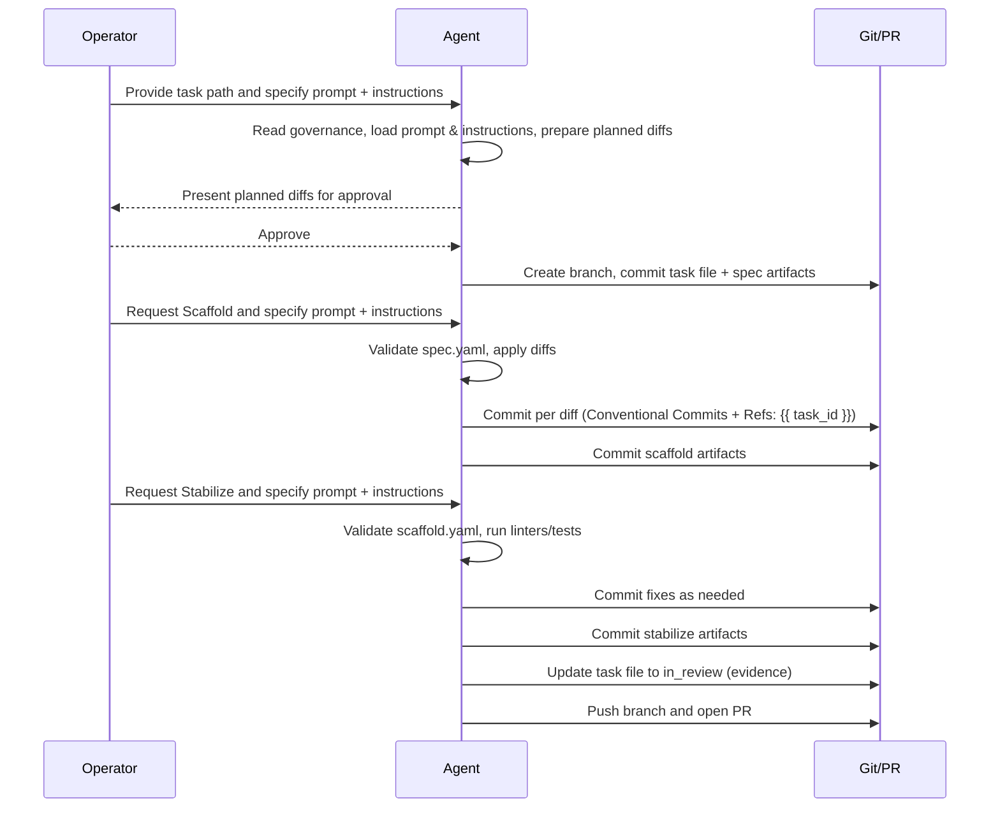

# The 3-Pass Plan: Spec (Plan) → Scaffold (Implement) → Stabilize (Validate)

This document explains how to execute our three-pass workflow end-to-end for any task defined under
`.ai/tasks/{{ task_id }}.yaml`. It describes the role of prompts vs. instructions, branch and commit conventions,
required artifacts and schemas, and provides a concrete example.

Audience: Operators, contributors, and AI agents running our prompts.

## Overview

The 3-pass plan is used for completing individual tasks within a project while following a consistent workflow. It may
be referred to as the "SSS" or "PIV" loop, depending on the operator's preferences.

**Pass 1: Spec (Plan)**

- Design the change safely.
- Produce planned diffs and write spec artifacts for handoff.
- Existing sources remain unmodified.

**Pass 2: Scaffold (Implement)**

- Apply the planned diffs.
- Commit minimal, logical changes that implement the spec (one commit per planned diff).
- Produce scaffolding artifacts for handoff.

**Pass 3: Stabilize (Validate)**

- Run checks (linters, automated tests, etc.) to ensure the change is stable.
- Fix issues found by checks, if any; commit changes.
- Prepare the branch for review.
- Update the task YAML file so that the status is set to `in_review`, and evidence is added. Commit the updated task
  file and open a PR.

Artifacts created by each pass are stored in the `.ai/tasks/{{ task_id }}/` directory and are validated against the JSON
schemas located in `.ai/schemas/`. Helper tools used to validate the artifacts are located in `.ai/tools/` and should be
executed using `uv`.

### Glossary and Roles

- `task file`: the YAML file at `.ai/tasks/{{ task_id }}.yaml` that declares a single task, its status, and evidence.
- `task artifacts directory`: the directory `.ai/tasks/{{ task_id }}/` holding all machine-readable and human-friendly
  artifacts for that task (`spec.yaml`, `scaffold.yaml`, `stabilize.yaml`, `*-report.md`, notes).
- `planned_diffs`: the list of intended repository changes described in `.ai/tasks/{{ task_id }}/spec.yaml`. These are
  produced during the Spec pass and consumed by the Scaffold pass.
- `applied_diffs`: the list of actually applied changes recorded in `.ai/tasks/{{ task_id }}/scaffold.yaml`, including
  commit SHAs per diff.
- `branch_plan.initial_branch_name`: the branch name that the Spec pass defines for the task (e.g.,
  `feat/CFG-001-add-config`); Scaffold and Stabilize must run on this branch.
- `evidence`: structured information stored in the task file under `evidence`, including:
    - `commit` (SHA, usually the squash commit on `main` when the task is `done`),
    - `branchName` (task branch, optional),
    - `timestamp` (ISO-8601, optional),
    - `testSummary` (OBJECT describing test outcomes),
    - optional `ciRunUrl` and `prUrl`.

**Roles per pass:**

- Spec: *Principal Architect* — designs the change and writes `spec.yaml` and `planned-diffs.md`.
- Scaffold: *Senior Software Engineer* — implements `planned_diffs` and records `applied_diffs` in `scaffold.yaml` and
  `scaffold-report.md`.
- Stabilize: *Senior Software Engineer* — runs checks, applies minimal fixes, records results in `stabilize.yaml` and
  `stabilize-report.md`, and prepares the PR.

### Prompts vs. Instructions (what to run)

**Prompts (what to do):**

- Spec: `.github/prompts/spec-pass.prompt.md`
- Scaffold: `.github/prompts/scaffold-pass.prompt.md`
- Stabilize: `.github/prompts/stabilize-pass.prompt.md`

**Instructions (how to do it, reusable policy):**

- Spec: `.github/instructions/spec-pass.instructions.md`
- Scaffold: `.github/instructions/scaffold-pass.instructions.md`
- Stabilize: `.github/instructions/stabilize-pass.instructions.md`

Use: when invoking a prompt with your AI agent, also load the matching instruction file for consistent behavior across
tasks.

### Conventions you must follow

- **Branch naming**: `<type>/{{ task_id }}-<slug>`; one slash only. Types: `feat`, `bugfix`, `chore`, `refactor`,
  `docs`, `test`.
- **Commit messages**: follow Conventional Commits guidelines as described in `.github/git-commit-instructions.md`.
- **Task status transitions**: `pending` -> `in_progress` -> `in_review` -> `done`.
- **Artifacts directory**: `.ai/tasks/{{ task_id }}/`.
- **Schemas**:
    - Spec: `.ai/schemas/spec-artifact.schema.v0.1.json`
    - Scaffold: `.ai/schemas/scaffold-artifact.schema.v0.1.json`
    - Stabilize: `.ai/schemas/stabilize-artifact.schema.v0.1.json`
    - Task File: `.ai/schemas/task-file.schema.v0.1.json`
- **Evidence**: when updating `evidence.testSummary` in `.ai/tasks/{{ task_id }}.yaml`, use the object shape
  described in `.ai/schemas/task-file.schema.v0.1.json`. Evidence may also include `timestamp` (ISO-8601) and
  `branchName` (string).

## Workflow

### Pass 1: Spec (Plan)

**Goal:** Produce a precise, reviewable plan with zero source edits. Write artifacts for the scaffolding pass to
consume.

**Files to use:**

- Prompt: `.github/prompts/spec-pass.prompt.md`
- Instructions: `.github/instructions/spec-pass.instructions.md`

**Spec pass sequence (including artifact writing and branch creation):**

1. On `main`, run the Spec prompt and:
    - read `docs/PLANNING.md` and `docs/TASKS.md`,
    - read the task file `.ai/tasks/{{ task_id }}.yaml`,
    - read the spec artifact schema file `.ai/schemas/spec-artifact.schema.v0.1.json`,
    - propose and refine `planned_diffs` with the operator.
2. Still on `main`, write (uncommitted) artifacts:
    - `.ai/tasks/{{ task_id }}/spec.yaml`
    - `.ai/tasks/{{ task_id }}/planned-diffs.md`
3. The operator reviews these artifacts and the chat output. **Wait for the operator before continuing.** If changes are
   needed, update and rewrite the artifacts on `main` (still uncommitted).
4. Once the operator explicitly approves the spec:
    - create the task branch: `<type>/{{ task_id }}-{{ slug }}` (for example, `feat/CFG-001-add-config`),
    - on the new branch, update `.ai/tasks/{{ task_id }}.yaml` to set `status: in_progress` and optionally record
      `branchName` and `timestamp`,
    - stage and commit, together, as the FIRST commit on the new branch:
        - `.ai/tasks/{{ task_id }}.yaml`
        - `.ai/tasks/{{ task_id }}/spec.yaml`
        - `.ai/tasks/{{ task_id }}/planned-diffs.md`

**Output of Spec:**

- Planned diffs in the chat.
- `.ai/tasks/{{ task_id }}/planned-diffs.md` and `.ai/tasks/{{ task_id }}/spec.yaml` files.
- First branch commit (after approval) that contains the task file status change and the spec artifacts.

### Pass 2: Scaffold (Implement)

**Goal:** Apply the planned diffs and capture exactly what was changed. Write artifacts for the stabilization pass to
consume.

**Files to use:**

- Prompt: `.github/prompts/scaffold-pass.prompt.md`
- Instructions: `.github/instructions/scaffold-pass.instructions.md`

**What happens:**

1. The agent validates `.ai/tasks/{{ task_id }}/spec.yaml` against `.ai/schemas/spec-artifact.schema.v0.1.json` and
   confirms the task branch is checked out.
2. The agent applies `planned_diffs` in order. For each change, it stages and commits the change to the branch using
   the Conventional Commits message format.
3. The agent writes the scaffold artifacts:
    - `.ai/tasks/{{ task_id }}/scaffold.yaml` (machine-readable; validated against
      `.ai/schemas/scaffold-artifact.schema.v0.1.json`)
    - `.ai/tasks/{{ task_id }}/scaffold-report.md` (human-friendly)
4. The agent commits the scaffold artifacts using a Conventional Commit with the appropriate scope (e.g.,
   `chore(artifacts): add scaffold artifacts`) and includes the task reference in the footer.

**Output of Scaffold:**

- A series of Conventional Commits applying the planned diffs.
- `.ai/tasks/{{ task_id }}/scaffold.yaml` and `.ai/tasks/{{ task_id }}/scaffold-report.md` committed to the branch.

### Pass 3: Stabilize (Validate)

**Goal:** Run checks, fix issues, record results, update the task file, and open a PR.

**Files to use:**

- Prompt: `.github/prompts/stabilize-pass.prompt.md`
- Instructions: `.github/instructions/stabilize-pass.instructions.md`

**What happens:**

1. The agent validate `.ai/tasks/{{ task_id }}/scaffold.yaml` (and optionally re-validates
   `.ai/tasks/{{ task_id }}/spec.yaml`).
2. The agent runs checks: linters, unit tests, integration tests, quality gates (coverage), as applicable.
3. The agent performs up to a few small fix iterations. Each fix is committed using a Conventional Commit.
4. The agent writes stabilize artifacts and validates the YAML:
    - `.ai/tasks/{{ task_id }}/stabilize.yaml` (machine-readable; `.ai/schemas/stabilize-artifact.schema.v0.1.json`)
    - `.ai/tasks/{{ task_id }}/stabilize-report.md` (human-friendly)
5. The agent updates the task file (`.ai/tasks/{{ task_id }}.yaml`):
    - `status: in_review`
    - `evidence`: include `commit` (SHA), `branchName` (optional), `timestamp` (ISO-8601) (optional), plus `testSummary`
      as an OBJECT per `.ai/schemas/task-file.schema.v0.1.json`. Include optional `ciRunUrl` and `prUrl` when available.
6. The agent commits the task file and stabilize artifacts.
7. The agent pushes the branch and opens a PR to the chosen base branch. Include links to artifacts in the PR body.

**Output of Stabilize:**

- Passing checks (or documented exceptions) and a PR ready for review.
- `.ai/tasks/{{ task_id }}/stabilize.yaml` and `.ai/tasks/{{ task_id }}/stabilize-report.md` committed to the branch.
- Task file status updated to `in_review` and structured evidence added.

## Example: Process `.ai/tasks/CFG-001.yaml`

### Spec (Plan)

- Run the Spec prompt with the Spec instructions loaded. Provide `.ai/tasks/CFG-001.yaml` when asked.
- Review the proposed diffs in the chat; operator will approve or request changes.
- Branch: `feat/CFG-001-add-config`
- The first commit includes:
    - `.ai/tasks/CFG-001.yaml` status updated to `in_progress`; optionally update branch name and timestamp.
    - `.ai/tasks/CFG-001/spec.yaml`
    - `.ai/tasks/CFG-001/planned-diffs.md`
    - Commit message example:
        ```markdown
        chore(artifacts): start the task branch and add spec artifacts.
      
        Refs: CFG-001
        ```

### Scaffold (Implement)

- Run the Scaffold prompt with the Scaffold instructions loaded.
- Agent validates `.ai/tasks/CFG-001/spec.yaml` and applies the planned diffs in order; one commit per change/diff.
- Agent writes and commits:
    - `.ai/tasks/CFG-001/scaffold.yaml`
    - `.ai/tasks/CFG-001/scaffold-report.md`
    - Commit message example:
        ```markdown
        chore(artifacts): add scaffold artifacts.
      
        Refs: CFG-001
        ```

### Stabilize (Validate)

- Run the Stabilize prompt with the Stabilize instructions loaded.
- Agent validates `.ai/tasks/CFG-001/scaffold.yaml`.
- Agent runs checks (linters, unit/integration tests, etc.) and iteratively fixes issues. Record issues which are
  unable to be fixed in `.ai/tasks/CFG-001/stabilize-report.md`.
- Agent writes and validates:
    - `.ai/tasks/CFG-001/stabilize.yaml`
    - `.ai/tasks/CFG-001/stabilize-report.md`
- Update `.ai/tasks/CFG-001.yaml` with `status: in_review` and structured evidence; include commit SHAs and
  `testSummary` object.
- Agent commits:
    - `.ai/tasks/CFG-001.yaml`
    - `.ai/tasks/CFG-001/stabilize.yaml`
    - `.ai/tasks/CFG-001/stabilize-report.md`
    - Commit message example:
        ```markdown
        chore(tasks): update task status and evidence; add stabilize artifacts.
      
        Refs: CFG-001
        ```

## Sample Session (Spec → Scaffold → Stabilize)

Below is a condensed, illustrative exchange (operator ↔ agent) with key shell commands. Note: use multiple `-m` flags or
a file/STDIN to ensure actual linefeeds in commit messages; do not embed `\n` literals.

```text
Operator: Run the Spec pass using the following prompt and instructions.
  - Prompt: .github/prompts/spec-pass.prompt.md
  - Instructions: .github/instructions/spec-pass.instructions.md
  The task file is at .ai/tasks/CFG-001.yaml.
Agent: Loading governance docs and the specified spec prompt/instructions. Summarizing acceptance criteria... Proposing planned diffs. Do you approve?
Operator: Approved. Use branch feat/CFG-001-add-config.
Agent: Creating branch, updating .ai/tasks/CFG-001.yaml to in_progress, writing spec artifacts, committing as first commit.

# Commands (agent)
$ git checkout -b feat/CFG-001-add-config
$ git add .ai/tasks/CFG-001.yaml .ai/tasks/CFG-001/spec.yaml .ai/tasks/CFG-001/planned-diffs.md
$ git commit -m "chore(artifacts): start task branch and add spec artifacts" -m "Refs: CFG-001"

Operator: Proceed to Scaffold using these files.
  - Prompt: .github/prompts/scaffold-pass.prompt.md
  - Instructions: .github/instructions/scaffold-pass.instructions.md
Agent: Validating spec.yaml; applying diffs; committing each change.

# Example commits (agent)
$ git add path/to/fileA
$ git commit -m "feat(schemas): add new config schema — initial" -m "Refs: CFG-001"
$ git add path/to/fileB
$ git commit -m "refactor(docs): tighten language in conventions" -m "Refs: CFG-001"

Agent: Writing scaffold artifacts and committing.
$ git add .ai/tasks/CFG-001/scaffold.yaml .ai/tasks/CFG-001/scaffold-report.md
$ git commit -m "chore(artifacts): add scaffold artifacts" -m "Refs: CFG-001"

Operator: Proceed to Stabilize using these files.
  - Prompt: .github/prompts/stabilize-pass.prompt.md
  - Instructions: .github/instructions/stabilize-pass.instructions.md
Agent: Validating scaffold.yaml; running linters; fixing a warning; committing fix.

$ git commit -am "fix(docs): remove trailing spaces in three-pass plan" -m "Refs: CFG-001"

Agent: Writing stabilize artifacts; validating stabilize.yaml; updating task file; opening PR.
$ git add .ai/tasks/CFG-001/stabilize.yaml .ai/tasks/CFG-001/stabilize-report.md
$ git commit -m "chore(artifacts): add stabilize artifacts" -m "Refs: CFG-001"
$ git add .ai/tasks/CFG-001.yaml
$ git commit -m "chore(tasks): update task status to in_review" -m "Refs: CFG-001"
$ git push -u origin feat/CFG-001-add-config
$ gh pr create --fill --base main --head feat/CFG-001-add-config
```

## Error-handling patterns

To avoid loops and ambiguous behavior, agents should follow these patterns:

### Spec pass

- **Missing governing docs** (`docs/PLANNING.md` or `docs/TASKS.md`):
    - Treat as empty files, proceed, and clearly state this assumption in the spec output.
- **Unclear acceptance criteria in the task file**:
    - Do not guess; add explicit QUESTIONS in the spec output and avoid over-specific planned diffs.

### Scaffold pass

- **Invalid `spec.yaml`** (schema validation fails):
    - Stop immediately.
    - Present the validation errors to the operator.
    - Do not modify any code or artifacts until the spec is corrected.
- **Markers not found or ambiguous when applying a `modify` planned diff**:
    - Attempt at most three targeted searches/strategies to locate a suitable insertion/modification point.
    - If still unclear:
        - do not perform the modification,
        - insert a TODO marker at a reasonable location,
        - record a QUESTION and the context in `scaffold-report.md`.
- **Schema validation failure for `scaffold.yaml`**:
    - Do not commit the invalid file.
    - Log details in `.ai/tasks/{{ task_id }}/scaffold-notes.md`.
    - Wait for the operator's direction.

### Stabilize pass

- **Invalid `scaffold.yaml`** or `spec.yaml`:
    - Stop, report validation errors, do not run checks.
- **Repeated test or lint failures**:
    - Attempt at most three small, targeted fix iterations.
    - After three iterations, stop making further changes and:
        - document remaining failures and hypotheses in `stabilize-report.md`,
        - add details to `.ai/tasks/{{ task_id }}/stabilize-notes.md`,
        - return control to the operator.
- **Flaky tests**:
    - First, try retries or minimal test-specific mitigations (e.g., sleep in tests only).
    - If still flaky, mark the tests as `xfail` with a clear reason.
    - In all cases, document them under a `Flaky tests` section in `stabilize-report.md` and add notes in
      `stabilize-notes.md`.

## Post-merge ritual (marking tasks as `done`)

The 3-pass plan brings tasks to `in_review` with an open PR. After the PR is merged (typically via squash), run this
short post-merge ritual on the main branch:

1. Identify the squash commit SHA on the base branch (for example, `main`) that corresponds to the merged PR.
2. Edit `.ai/tasks/{{ task_id }}.yaml` on the base branch:
    - set `status: done`,
    - set `evidence.commit` to the squash commit SHA,
    - optionally update:
        - `evidence.timestamp` (current ISO-8601 time),
        - `evidence.branchName` (the task branch name),
        - `evidence.prUrl` (link to the merged PR),
        - `evidence.ciRunUrl` (link to the CI run, if applicable).
3. Commit this change directly on the base branch using a Conventional Commit, for example:
    ```text
    chore(tasks): mark {{ task_id }} as done
    ```
4. Update `docs/TASKS.md` to mark the task as completed and, if needed, add any follow-up tasks (including those for
   flaky tests or design improvements discovered during Scaffold/Stabilize).

This ritual completes the task lifecycle: `pending` → `in_progress` → `in_review` → `done`.

## Diagram (Mermaid)


